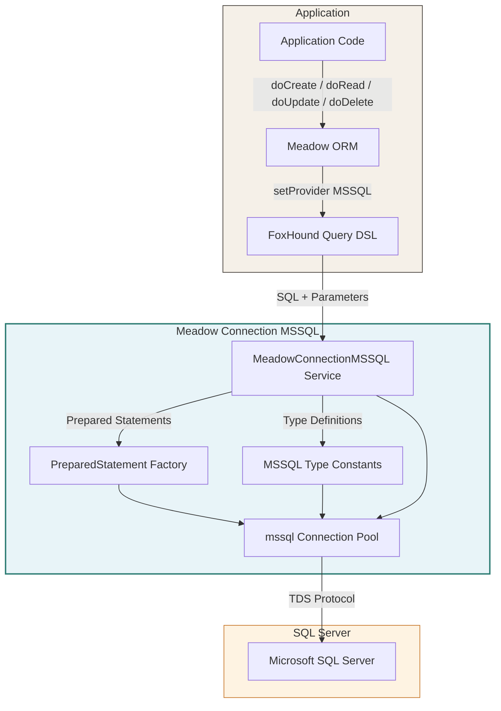
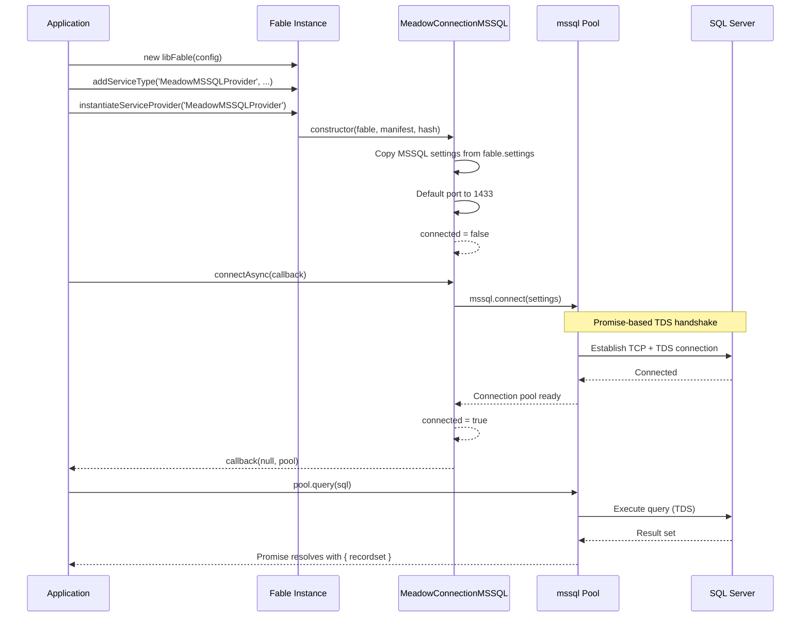
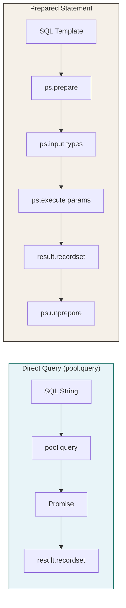
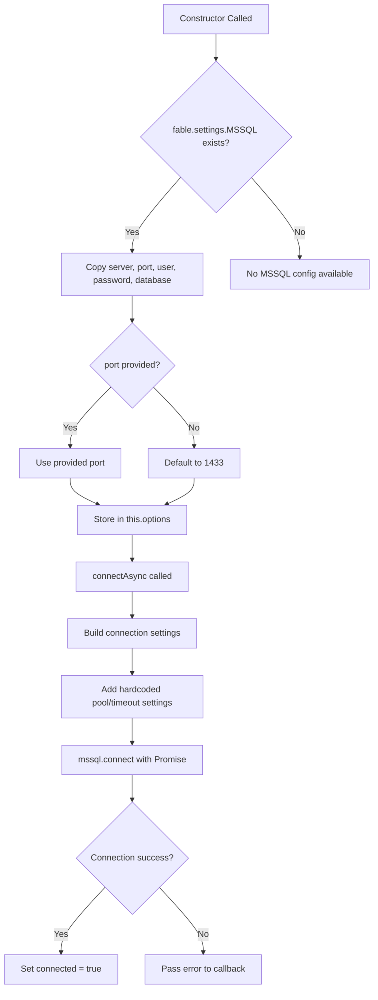
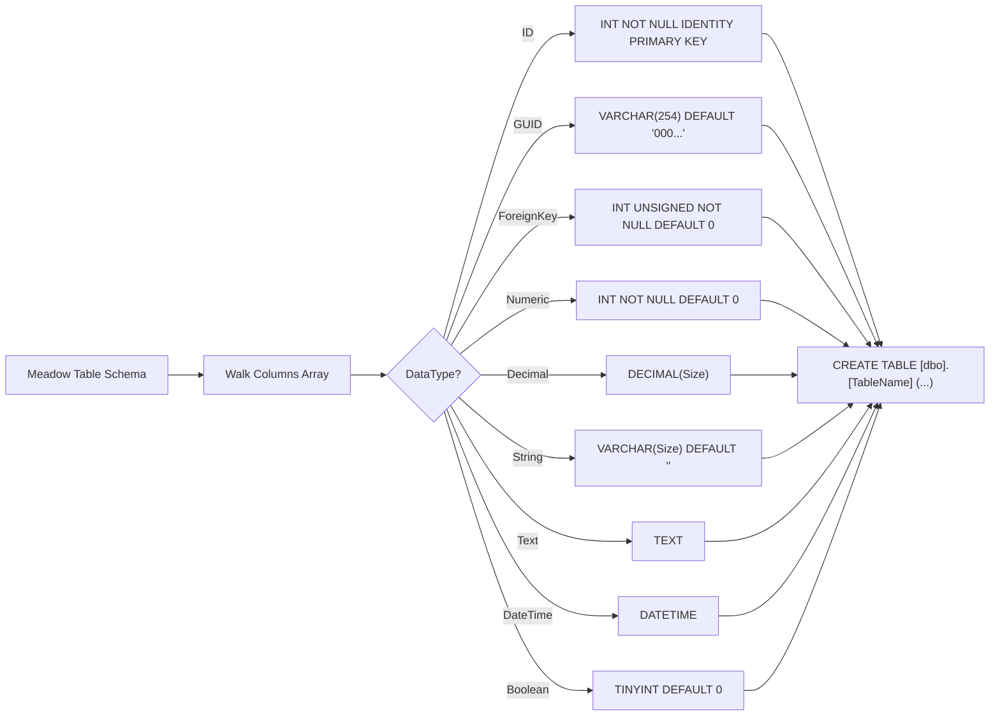
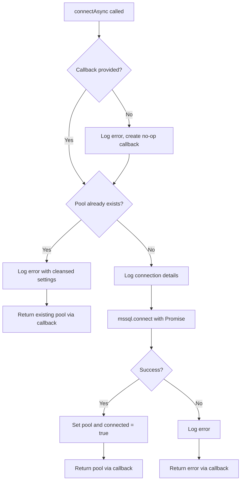
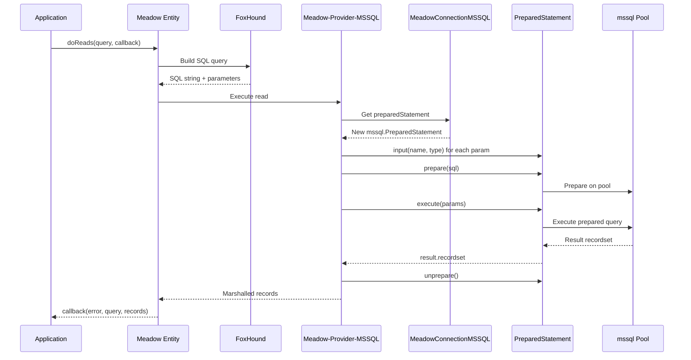

# Architecture

Meadow Connection MSSQL bridges the Meadow data access layer and Microsoft SQL Server. This page documents the component design, data flow, connection lifecycle, and how the module integrates with the broader Retold ecosystem.

---

## System Architecture



---

## Component Responsibilities

### MeadowConnectionMSSQL Service

The core class, extending `FableServiceProviderBase`. It manages the lifecycle of the mssql connection pool:

- **Construction** -- Reads MSSQL settings from Fable config, copies `server`, `port`, `user`, `password`, `database` into options, defaults port to 1433
- **Async Connection** -- Creates the pool via `mssql.connect()` with hardcoded timeout and pool settings
- **Pool Management** -- Guards against double-connect, masks passwords in log output
- **DDL Generation** -- Produces `CREATE TABLE` statements with `[dbo].[TableName]` notation and `IDENTITY PRIMARY KEY`

### PreparedStatement Factory

The `preparedStatement` getter creates a new `mssql.PreparedStatement` bound to the active pool on each access:

- Validates that the pool is connected before creating the statement
- Each statement is independent and must be manually unprepared after use
- Used by Meadow's MSSQL provider for all query execution

### MSSQL Type Constants

The `MSSQL` getter exposes the raw `mssql` npm package, giving access to SQL Server type constants:

- Used to define input parameters on prepared statements (`MSSQL.Int`, `MSSQL.VarChar`, etc.)
- Required for type-safe parameterized queries

---

## Connection Lifecycle



---

## Query Execution Models

MSSQL supports two distinct query patterns:



### Direct Query

Use `pool.query()` for ad-hoc SQL. Returns a Promise with `result.recordset` (array of row objects):

```javascript
pool.query('SELECT TOP 10 * FROM Book')
    .then((pResult) => { /* pResult.recordset */ });
```

### Prepared Statement

Use `preparedStatement` for parameterized queries with typed inputs. Requires a manual lifecycle (prepare -> execute -> unprepare):

```javascript
let ps = connection.preparedStatement;
ps.input('id', connection.MSSQL.Int);
ps.prepare('SELECT * FROM Book WHERE IDBook = @id', (err) => {
    ps.execute({ id: 42 }, (err, result) => {
        ps.unprepare(() => {});
    });
});
```

Meadow's MSSQL provider uses prepared statements for all CRUD operations.

---

## Connection Settings Flow



### Hardcoded Pool Settings

These settings are applied internally and are not currently configurable via Fable settings:

| Setting | Value | Purpose |
|---------|-------|---------|
| `requestTimeout` | 80,000 ms | Per-query execution timeout |
| `connectionTimeout` | 80,000 ms | Connection establishment timeout |
| `pool.max` | 10 | Maximum concurrent connections |
| `pool.min` | 0 | Minimum connections kept alive |
| `pool.idleTimeoutMillis` | 30,000 ms | Close idle connections after 30s |
| `options.useUTC` | `false` | Use local time for DATETIME values |
| `options.trustServerCertificate` | `true` | Trust self-signed SSL certificates |

---

## DDL Generation Flow

The `generateCreateTableStatement()` method walks a Meadow table schema and produces MSSQL DDL:



### MSSQL DDL Conventions

- Table names are schema-qualified: `[dbo].[TableName]`
- All column names are bracketed: `[ColumnName]`
- `ID` columns use `IDENTITY PRIMARY KEY` (inline, no separate clause)
- No charset or collation clause (uses server defaults)
- `GUID` defaults to `'00000000-0000-0000-0000-000000000000'` and uses `VARCHAR(254)`
- Drop statements use `IF OBJECT_ID(..., 'U') IS NOT NULL` guard with `GO` batch separator

---

## Connection Safety



### Password Protection

- Connection details are logged at `info` level when connecting
- If a duplicate connection is detected, the error log includes connection settings with the password masked
- Passwords are never included in error messages or query logs

---

## Meadow Integration

When a Meadow entity sets its provider to `'MSSQL'`, queries follow this path:



The MSSQL provider uses prepared statements for all operations, with `SCOPE_IDENTITY()` for retrieving auto-generated IDs after inserts.

---

## Comparison with Other Connectors

| Feature | MSSQL | MySQL | SQLite | RocksDB |
|---------|-------|-------|--------|---------|
| Connection Type | Pool (TDS) | Pool (TCP) | File handle | File handle |
| Server Required | Yes | Yes | No | No |
| Connection Method | Async only | Sync or Async | Async | Async |
| Query API | Promise-based | Callback-based | Sync | Callback-based |
| Result Format | `result.recordset` | `(err, rows, fields)` | Direct return | `(err, value)` |
| Prepared Statements | Yes (getter) | No (use pool) | No | N/A |
| Driver Access | Yes (`MSSQL` getter) | No | No | No |
| Auto-Connect | Via `connect()` | Via flag | No | No |
| DDL Schema Prefix | `[dbo].[Table]` | None | None | N/A |
| Column Brackets | `[Column]` | None | None | N/A |
| Auto-Increment | `IDENTITY PRIMARY KEY` | `AUTO_INCREMENT` | `AUTOINCREMENT` | N/A |
| Underlying Library | mssql (Tedious) | mysql2 | better-sqlite3 | rocksdb |
